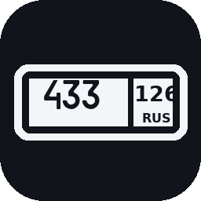
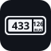

# НОМЕРОК 3D — брелоки-автономера для Bambu Lab A1 без AMS



Двухцветные брелоки в виде российского госномера: белая подложка + чёрные буквы,
цифры и рамка, вдавленная надпись (марка машины) на обороте. Печатаются на одном
сопле без AMS — принтер один раз останавливается, и ты меняешь пруток с белого на чёрный.

В репозитории два слоя:

| | |
|---|---|
| **Приложение** `НОМЕРОК 3D.exe` | окошко, где набираешь номер колёсиками, выбираешь крепление и жмёшь «Создать 3MF» |
| **Генератор** `generate_keychain.py` | тот же движок из командной строки, если нужна пачка или свои правки |

---

## 1. Приложение

### Скачать

Готовый `.exe` для Windows 10/11 собирается автоматически и лежит в релизе
[**app-latest**](../../releases/tag/app-latest) — качай оттуда, установка не нужна,
это один файл.

> При первом запуске Windows покажет синее окно SmartScreen: «Подробнее» →
> «Выполнить в любом случае». Так бывает с любой программой без платной подписи
> разработчика (~10 тыс. ₽/год) — для себя и для продажи брелоков это не мешает.

### Что внутри



* **Номер — колёсами.** Шесть колёс под формат `Х 999 ХХ` и три под регион.
  В буквенных колёсах только 12 букв, которые реально бывают на российских номерах
  (АВЕКМНОРСТУХ) — ошибиться нельзя. Крути колесо мышкой, тяни или просто набери
  с клавиатуры. Кнопка «вставить целиком» принимает `Р433ЕК126` одной строкой,
  латиницу переводит в кириллицу сама.
* **Крепление — с ограничением по физике.**
  * *Ушко* — колечко сбоку, за пределами пластины. Номер остаётся целым,
    отверстие можно хоть 12 мм. **Для карабина толщиной 5 мм бери 6 мм.**
  * *Отверстие в пластине* — компактно, но программа не даст сделать его больше,
    чем позволяет высота брелока: от края отверстия до края всегда остаётся
    минимум 2 мм пластика (для 60 мм брелока потолок — 8,9 мм).
  * *Без крепления* — если хочешь приклеить или просверлить сам.
* **Марка на обороте** — вдавленная гравировка, глубина всегда кратна слою.
  Текст автоматически зеркалится, чтобы читался, когда перевернёшь брелок.
* **Живое превью** лица и оборота — видно результат до нарезки.
* **Цифры, а не гадание:** габарит, вес в граммах, примерное время печати
  и **номер слоя, на котором ставить паузу**.
* **Список заказов.** Кнопка «+ В список» копит брелоки, и при генерации
  все они дополнительно раскладываются на **один стол** — печатаются за один
  проход с одной сменой филамента. Для продаж это главная экономия времени.
* **На выходе** в выбранной папке: `3MF` с паузой, `3MF` под AMS, три STL,
  SVG-превью и памятка `КАК ПЕЧАТАТЬ.txt` — можно сразу отдавать заказчику.

### Запустить без exe (любая ОС)

```bash
python3 -m venv .venv
.venv/bin/pip install -r requirements-app.txt
.venv/bin/python -m app.main          # окно приложения
.venv/bin/python -m app.server        # или в браузере: http://127.0.0.1:8770
```

На Windows для этого есть `run_app.bat` (двойной клик).

### Собрать exe самому

```bat
build_exe.bat
```

Скрипт сам создаст окружение, поставит зависимости и PyInstaller и положит
результат в `dist\НОМЕРОК 3D.exe`. То же самое делает GitHub Actions
(`.github/workflows/build-exe.yml`) при каждом изменении приложения.

---

## 2. Печать на A1 без AMS — по шагам

Одинаково для любого брелока, хоть из приложения, хоть из папки `out/`.

### Шаг 1. Открыть и настроить

Открой `*_A1_bez_AMS.3mf` в Bambu Studio (File → Open Project). Заправь **белый** PLA.

> 🟡 Уведомление **«The 3mf is not from Bambu Lab, load geometry data only»** —
> нормальное. Студия берёт из файла модель и разбивку на детали, а настройки печати
> оставляет твои. Паузу она из чужого файла не берёт принципиально — поэтому шаг 2.

| Параметр | Значение | Почему |
|---|---|---|
| Профиль | **0.20 mm Standard** | подложка = ровно 12 слоёв |
| Высота слоя | **0,2 мм — не менять** | от неё зависит номер слоя паузы |
| Заполнение | **100 %** | деталь крошечная, буквы лягут на сплошную поверхность |
| Стенки | 3 | |
| Поддержки | **выкл** | |

> 🔤 **Первый слой в предпросмотре будет «дырявым»** — с прорезями в виде букв
> надписи на обороте. Так и надо: брелок лежит на столе лицом вверх, надписью вниз.
> Гравировка занимает два нижних слоя, третий закроет её сверху. Буквы выйдут
> гладкими и глянцевыми — их формует сама поверхность стола.

### Шаг 2. Нарезать и поставить паузу ← самый важный шаг

Нажми **«Нарезка» (Slice)** → вкладка **«Предпросмотр» (Preview)**. Справа появится
вертикальный ползунок слоёв со значком **«+»**.

1. «**+**» → **«Jump to Layer»** → номер слоя паузы (приложение показывает его
   в карточке «Пауза», для стандартных настроек это **13**) → OK.
   *Проверка: на этом слое уже видны буквы, на предыдущем — чистая белая пластина.*
2. «**+**» → **«Add Pause»**. Подсказка студии: *«Insert a pause command at the
   beginning of this layer»* — пауза встаёт **перед** слоем, ровно между цветами.
3. Нажми **«Нарезка» ещё раз** — иначе пауза не попадёт в G-code.


Пункт **«Change Filament»** не используем: без AMS принтер команду смены инструмента
игнорирует и печатает всё одним цветом. Нужна именно **пауза**.

### Шаг 3. Печать и смена цвета

1. Первые 12 слоёв (почти вся печать) — белым.
2. На Z = 2,4 мм принтер уедет в сторону и пикнет.
3. На экране принтера: **Филамент → Выгрузить** → вынь белый пруток.
4. Вставь **чёрный** → **Загрузить**. **Дожди чистого чёрного из сопла** — если
   останется белое, первые буквы будут серыми. Продави ещё 1–2 раза.
5. **Resume** — последние 3 слоя (пара минут) печатаются чёрным.

---

## 3. Готовые брелоки в репозитории

| Брелок | Оборот | Крепление | Файлы |
|---|---|---|---|
| **Р788РК 126** | «Москвич 3» | отверстие Ø4 мм | [`out/P788PK_126/`](out/P788PK_126) |
| **Р433ЕК 126** | «Changan» | отверстие Ø4 мм | [`out/P433EK_126/`](out/P433EK_126) |


`out/vse_brelki_odin_stol_A1_bez_AMS.3mf` — оба на одном столе, одна пауза на двоих.

Геометрия построена по ГОСТ Р 50577 (тип 1): пропорции поля 520 × 112, окантовка,
разделитель блока региона, высоты знаков 76/56/58/20. Шрифт — настоящий `RoadNumbers`,
которым набирают госномера.

| | |
|---|---|
| Габарит | 60 × 12,9 × 3,0 мм |
| Высота цифр / букв | 8,8 / 6,7 мм |
| Белая подложка | Z 0 … 2,4 мм (слои 1–12) |
| Чёрный рельеф | Z 2,4 … 3,0 мм (слои 13–15) |
| Гравировка на обороте | буквы 5 мм, глубина 0,4 мм (слои 1–2) |
| Пластик | ≈ 2,4 г на брелок, ~20 минут |

---

## 4. Почему пауза руками, а не «заложить в 3MF»

**Почему не «Change Filament».** У A1 **без AMS** команда смены инструмента
(`Change Filament` / `T1`) игнорируется: принтер допечатает всё одним цветом.
Работает только пауза `M400 U1`.

**Почему пауза не сохраняется внутри 3MF.** В файле она есть — лежит в
`Metadata/custom_gcode_per_layer.xml` (формат правильный). Но студия переносит паузы
из файла в проект, только если считает 3MF «своим», а для этого в архиве должен лежать
`Metadata/project_settings.config` — полный дамп всех настроек печати. Вот это место
в исходниках Bambu Studio (`Plater.cpp`):

```cpp
if (load_model && !load_config) { ; }            // чужой 3mf → паузы выбрасываются
else { this->model.plates_custom_gcodes = model.plates_custom_gcodes; }
```

Подделать `project_settings.config` можно, но он перезапишет твои профили печати
целиком (скорости, температуры, поток) — ради экономии четырёх кликов это плохой
размен, поэтому в проекте его нет.

**Апгрейд.** Для A1 (не mini) есть готовый G-code для поля «Change filament G-code»
в настройках принтера: [avatorl/bambu-a1-g-code](https://github.com/avatorl/bambu-a1-g-code) —
с ним смена филамента становится автоматической паузой, и файл `..._2_filamenta.3mf`
печатается сам. То же самое произойдёт, если появится **AMS lite**.

---

## 5. Генератор из командной строки

```bash
python3 -m venv .venv && .venv/bin/pip install -r requirements.txt

.venv/bin/python generate_keychain.py \
    --brelok "Р788РК 126 Москвич 3" \
    --brelok "Р433ЕК 126 Changan"
```

Каждый брелок кладётся в свою папку `out/<НОМЕР>_<РЕГИОН>/`; если их несколько —
рядом появляется общий стол `out/vse_brelki_odin_stol_*.3mf`.

| Ключ | По умолчанию | Что делает |
|---|---|---|
| `--brelok` | — | `"НОМЕР РЕГИОН НАДПИСЬ НА ОБОРОТЕ"`, можно повторять |
| `--number` / `--region` / `--back-text` | `Р788РК` / `126` / `Москвич 3` | то же по отдельности |
| `--length` | `60` | длина пластины, мм |
| `--base-h` / `--text-h` | `2.4` / `0.6` | толщина подложки и высота рельефа |
| `--hole-d` | `4.0` | диаметр отверстия |
| `--back-depth` | `0.4` | глубина гравировки (кратна слою!) |
| `--gap` | `7` | зазор между брелоками на общем столе |
| `--no-hole`, `--no-rus` | — | без отверстия / без надписи RUS |

---

## 6. Состав репозитория

```
app/                     настольное приложение НОМЕРОК 3D
  core.py                спецификация брелока, SVG-превью, запись файлов
  server.py, main.py     локальный сервер и окно приложения
  static/                интерфейс (HTML/CSS/JS, всё офлайн)
generate_keychain.py     движок геометрии + CLI
nomerok3d.spec           сборка exe (PyInstaller)
build_exe.bat            сборка exe в один клик на Windows
run_app.bat              запуск приложения без сборки
.github/workflows/       автосборка exe на GitHub Actions
fonts/                   RoadNumbers (шрифт госномеров), DejaVu Sans Bold, ГОСТ-шаблон
out/                     готовые брелоки: 3MF, STL, превью
```

Шрифт `RoadNumbers` 2.003 — свободно распространяемый шрифт российских
регистрационных знаков, взят из репозитория
[ulex/generate_license_plates](https://github.com/ulex/generate_license_plates)
(оттуда же ГОСТ-шаблон `ru.svg`). Надпись «RUS» и гравировка на обороте набраны
DejaVu Sans Bold (лицензия в `fonts/DejaVu-LICENSE.txt`) — в шрифте номеров нет
ни латиницы R/U/S, ни строчной кириллицы.
