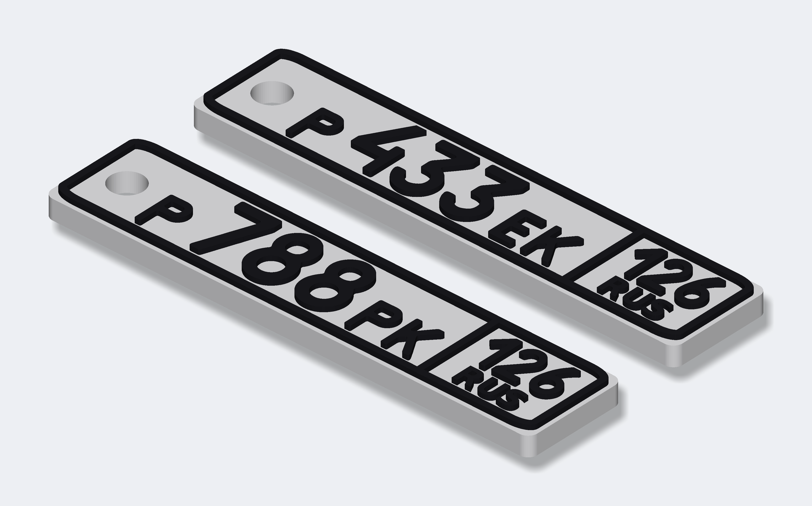
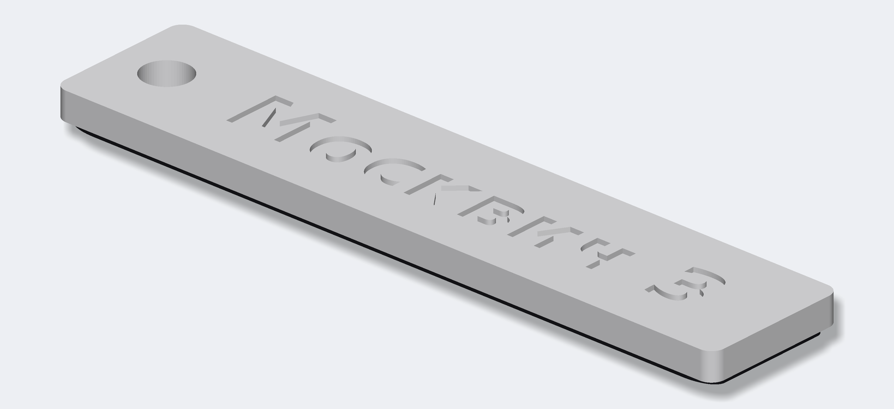
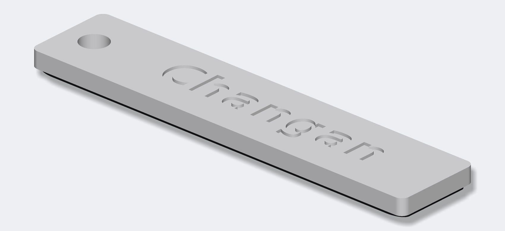
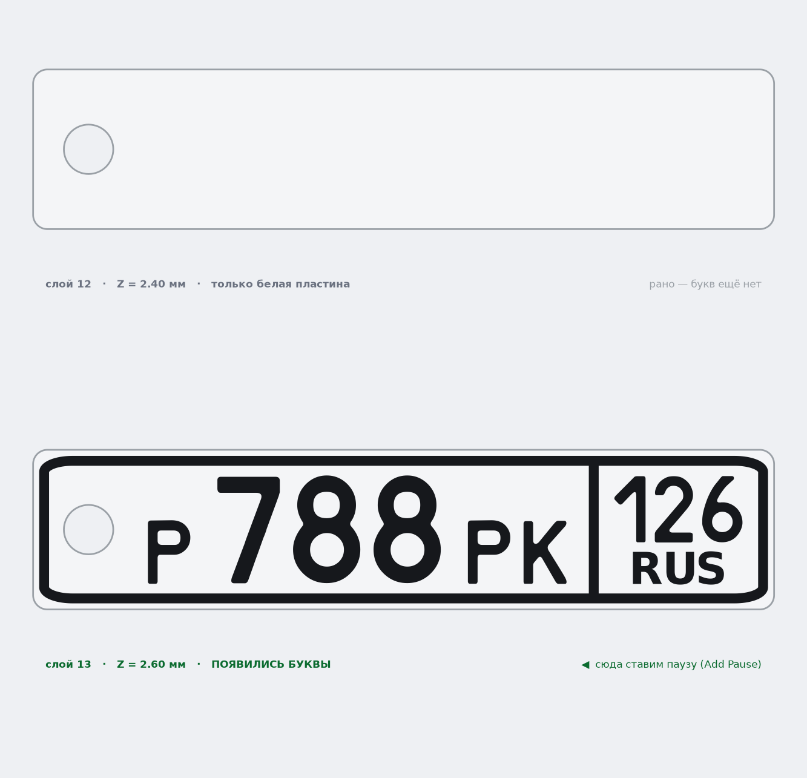

# Брелоки «автомобильный номер»

Двухцветные брелоки-номера для **Bambu Lab A1 без AMS**: белая подложка + чёрные буквы,
цифры и рамка. Один раз за печать принтер останавливается и просит поменять филамент.



| Брелок | Гравировка на обороте | Файлы |
|---|---|---|
| **Р788РК 126** | «Москвич 3» | [`out/P788PK_126/`](out/P788PK_126) |
| **Р433ЕК 126** | «Changan» | [`out/P433EK_126/`](out/P433EK_126) |

Геометрия построена по ГОСТ Р 50577 (тип 1): пропорции поля 520 × 112, окантовка,
разделитель блока региона, высоты знаков 76/56/58/20 — всё уменьшено до 60 мм.
Шрифт — настоящий `RoadNumbers`, которым набирают госномера.

| | |
|---|---|
| Габарит | **60 × 12,9 × 3,0 мм** |
| Высота цифр / букв | 8,8 / 6,7 мм |
| Белая подложка | Z 0 … **2,4 мм** (слои 1–12) |
| Чёрный рельеф | Z 2,4 … **3,0 мм** (слои 13–15) |
| Гравировка на обороте | буквы 5 мм, глубина 0,4 мм (слои 1–2) |
| Отверстие под кольцо | Ø 4,0 мм |
| Пластик | ≈ 2,4 г на брелок (оба — 4,8 г), ~20 / ~30 минут |

Оба брелока одинаковой толщины, поэтому **паузу можно ставить одну на оба** — см. шаг 2.

| Р788РК 126 | Р433ЕК 126 |
|---|---|
|  |  |

---

## 1. Какой файл печатать

| Файл | Для чего |
|---|---|
| **`out/vse_brelki_odin_stol_A1_bez_AMS.3mf`** | **основной** — оба брелока на одном столе, одна пауза, одна смена филамента |
| `out/P788PK_126/brelok_P788PK_126_A1_bez_AMS.3mf` | только «Москвич» |
| `out/P433EK_126/brelok_P433EK_126_A1_bez_AMS.3mf` | только «Changan» |
| `..._2_filamenta.3mf` | если появится AMS: деталям уже назначены филамент 1 и 2 |
| `out/<номер>/stl/..._brelok_celikom.stl` | запасной вариант — цельный STL, если 3MF не откроется |
| `out/<номер>/stl/..._1_podlozhka_BELAYA.stl` + `..._2_bukvy_CHERNYE.stl` | отдельные детали (для мультиматериала) |

---

## 2. Печать на A1 без AMS — по шагам

### Шаг 1. Открыть и настроить

Открой `vse_brelki_odin_stol_A1_bez_AMS.3mf` в Bambu Studio (File → Open Project).
Модели уже стоят по центру стола. Заправь в принтер **белый** PLA.

> 🟡 Bambu Studio покажет уведомление **«The 3mf is not from Bambu Lab, load geometry
> data only»** («загружена только геометрия»). Так и должно быть, файл не сломан:
> студия принимает из него модель и разбивку на детали, а настройки печати берёт
> твои — профиль A1. Паузу она из чужого файла не берёт принципиально
> (проверено по исходникам Bambu Studio), поэтому пауза ставится вручную в шаге 2 —
> это 4 клика.

Настройки (обычный профиль **0.20 mm Standard**, ничего экзотического):

| Параметр | Значение | Почему |
|---|---|---|
| Высота слоя | **0,2 мм** | подложка = ровно 12 слоёв, цвет сменится точно по границе |
| Первый слой | 0,2 мм | (по умолчанию) |
| Заполнение | **100 %** | деталь крошечная, зато буквы лягут на сплошную поверхность |
| Стенки | 3 | |
| Поддержки | **выкл** | |
| Юбка/кайма | не нужна | |

> ⚠️ Высоту слоя менять нельзя. При 0,25 или 0,3 мм граница 2,4 мм не попадёт
> на границу слоёв и цвет разделится криво (заодно и гравировка на обороте
> размажется на полслоя).

> 🔤 **В предпросмотре первый слой будет «дырявый» — с прорезями в виде букв
> «Москвич 3» и «Changan». Так и надо**: это гравировка на обороте, брелок лежит
> на столе лицом вверх, надписью вниз. Она занимает два нижних слоя, на третьем
> принтер просто перекроет её сверху. Буквы получатся гладкими и глянцевыми — их
> формует сама поверхность стола.

### Шаг 2. Нарезать и поставить паузу  ← самый важный шаг

Нажми **«Нарезка» (Slice)** и перейди на вкладку **«Предпросмотр» (Preview)**.
Справа появится вертикальный ползунок слоёв с кружком-бегунком и значком **«+»**.

1. Кликни **«+»** → **«Jump to Layer» / «Перейти к слою»** → введи **13** → OK.
   *Быстрая проверка, что слой верный: на модели видны буквы, цифры и рамка.
   Опусти ползунок на один слой вниз (стрелка ↓) — буквы исчезают, остаётся
   гладкая белая пластина. Значит 13-й слой — первый чёрный. Вернись стрелкой ↑.*
2. Кликни **«+»** → **«Add Pause» / «Добавить паузу»**.
   Подсказка самой студии: *«Insert a pause command at the beginning of this layer»* —
   пауза встаёт **перед** печатью выбранного слоя, то есть ровно между белым и чёрным.
3. На ползунке появится метка паузы.
4. Нажми **«Нарезка» (Slice)** ещё раз — **без повторной нарезки пауза в G-code не попадёт.**
   (Кстати, кнопка печати до повторной нарезки и так будет заблокирована.)

Как отличить нужный слой — вот так это выглядит в предпросмотре:



Слой паузы **одинаковый для обоих брелоков** (подложка у них одной толщины), так что
при печати вдвоём пауза всё равно одна.

Пункт **«Change Filament»** в этом меню не используем: без AMS принтер команду
смены инструмента игнорирует и печатает всё одним цветом. Нужна именно **пауза**.

### Шаг 3. Печать и смена цвета

1. Отправь на печать. Первые 12 слоёв (почти вся печать) идут белым.
2. На Z = 2,4 мм принтер уедет в сторону и встанет на паузу (пикнет).
3. На экране принтера: **Филамент → Выгрузить (Unload)** → вытащи белый пруток.
4. Вставь **чёрный** → **Загрузить (Load)**. Принтер прогонит пластик в «какашкосборник».
   **Дожди, пока из сопла не пойдёт чистый чёрный** — если останется белое, первые
   буквы будут серыми. Не жалей, продави ещё 1–2 раза кнопкой экструзии.
5. Нажми **«Продолжить» / Resume** на экране принтера (или в Bambu Studio → Устройство).
6. Последние 3 слоя (пара минут) печатаются чёрным: буквы, цифры, рамка и разделитель.

Готово — снимай с остывшего стола и вставляй кольца.

> 💡 Нужно ещё несколько копий (в запас, на вторую связку)? Правый клик по модели →
> «Set number of instances» → 2–4 штуки. Пауза одна на всю пластину, менять филамент
> всё равно придётся один раз.

---

## 3. Что печатается на каком слое

```
слой 15   Z 3.0  ■ чёрный   буквы / цифры / рамка (верх)
слой 14   Z 2.8  ■ чёрный
слой 13   Z 2.6  ■ чёрный   ← первый слой после паузы
─────────────────────────── ПАУЗА, меняем белый → чёрный
слой 12   Z 2.4  □ белый    верхняя поверхность подложки
...
слой  3   Z 0.6  □ белый    перекрывает гравировку сверху
слой  2   Z 0.4  □ белый    ⌷ прорези надписи на обороте
слой  1   Z 0.2  □ белый    ⌷ прорези надписи — первый слой на столе
```

Надпись на обороте зеркальная в модели: брелок переворачивают через длинную ось
(как крутанёшь его на колечке), и тогда она читается нормально.

---

## 4. Почему пауза руками, а не «заложить в 3MF»

**Почему не «Change Filament».** У A1 **без AMS** команда смены инструмента
(`Change Filament` / `T1`) игнорируется: принтер допечатает всё одним цветом.
Работает только пауза `M400 U1`.

**Почему пауза не сохраняется внутри 3MF.** В файле она есть — лежит в
`Metadata/custom_gcode_per_layer.xml` (формат правильный, Bambu Studio такой парсит).
Но студия переносит паузы из файла в проект только если считает 3MF «своим», а для
этого в архиве должен лежать `Metadata/project_settings.config` — полный дамп всех
настроек печати. Вот это место в исходниках Bambu Studio (`Plater.cpp`):

```cpp
if (load_model && !load_config) { ; }            // чужой 3mf → паузы выбрасываются
else { this->model.plates_custom_gcodes = model.plates_custom_gcodes; }
```

а `load_config` становится `false` как раз когда `project_settings.config` пустой
или отсутствует — тогда и всплывает то самое «load geometry data only».

Подделать этот файл можно, но он перезапишет твои профили печати целиком (скорости,
температуры, поток) значениями из файла — ради экономии четырёх кликов это плохой
размен, поэтому в проекте его нет.

**Апгрейд на будущее.** Если надоест ставить паузу руками, для A1 (не mini) есть
готовый G-code для поля «Change filament G-code» в настройках принтера:
[avatorl/bambu-a1-g-code](https://github.com/avatorl/bambu-a1-g-code) — с ним обычная
смена филамента превращается в автоматическую паузу, и тогда файл
`..._2_filamenta.3mf` (подложке назначен филамент 1, буквам — 2) печатается сам.
То же самое произойдёт автоматически, если появится **AMS lite**.

---

## 5. Сделать брелок с другим номером

```bash
python3 -m venv .venv && .venv/bin/pip install -r requirements.txt

# как собраны эти два (ключ --brelok можно повторять сколько угодно раз):
.venv/bin/python generate_keychain.py \
    --brelok "Р788РК 126 Москвич 3" \
    --brelok "Р433ЕК 126 Changan"

# один брелок без надписи на обороте:
.venv/bin/python generate_keychain.py --brelok "А123ВС 36"
```

Каждый брелок кладётся в свою папку `out/<НОМЕР>_<РЕГИОН>/`, а если их несколько —
рядом появляется ещё и общий стол `out/vse_brelki_odin_stol_*.3mf`.

Полезные ключи:

| Ключ | По умолчанию | Что делает |
|---|---|---|
| `--brelok` | — | `"НОМЕР РЕГИОН НАДПИСЬ НА ОБОРОТЕ"`, можно повторять |
| `--number` / `--region` / `--back-text` | `Р788РК` / `126` / `Москвич 3` | то же самое по отдельности, если брелок один |
| `--length` | `60` | длина брелока, мм |
| `--base-h` | `2.4` | толщина белой подложки (кратна 0,2!) |
| `--text-h` | `0.6` | высота чёрного рельефа |
| `--hole-d` | `4.0` | диаметр отверстия под кольцо |
| `--back-depth` | `0.4` | глубина гравировки, мм (кратна высоте слоя!) |
| `--gap` | `7` | зазор между брелоками на общем столе, мм |
| `--no-hole`, `--no-rus` | — | без отверстия / без надписи RUS |

Скрипт пересчитает толщину подложки в слои, подскажет номер слоя для паузы и нарисует превью.

---

## 6. Состав репозитория

```
generate_keychain.py     параметрический генератор (геометрия, 3MF, превью)
requirements.txt         зависимости
fonts/RoadNumbers2.0.ttf шрифт госномеров
fonts/ru.svg             ГОСТ-шаблон номерного знака (эталон пропорций)
out/P788PK_126/          брелок «Москвич 3»: 3MF, STL, превью
out/P433EK_126/          брелок «Changan»:   3MF, STL, превью
out/vse_brelki_*.3mf     оба брелока на одном столе
```

Шрифт `RoadNumbers` 2.003 — свободно распространяемый шрифт российских
регистрационных знаков, взят из репозитория
[ulex/generate_license_plates](https://github.com/ulex/generate_license_plates)
(оттуда же ГОСТ-шаблон `ru.svg`). Надпись «RUS» и гравировка на обороте набраны
DejaVu Sans Bold — в шрифте номеров нет ни латиницы R/U/S, ни строчной кириллицы.
