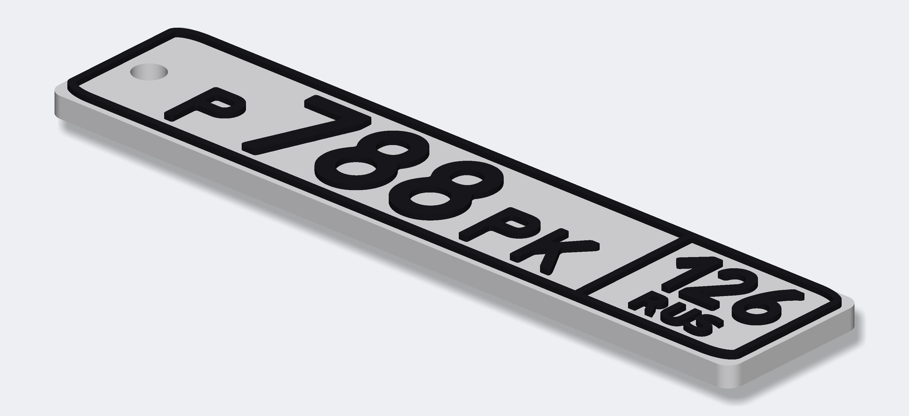
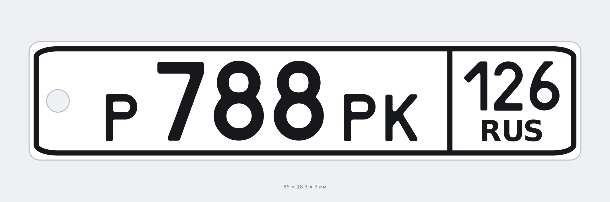

# Брелок «автомобильный номер Р788РК 126»

Двухцветный брелок-номер для **Bambu Lab A1 без AMS**: белая подложка + чёрные буквы,
цифры и рамка. Один раз за печать принтер останавливается и просит поменять филамент.




Геометрия построена по ГОСТ Р 50577 (тип 1): пропорции поля 520 × 112, окантовка,
разделитель блока региона, высоты знаков 76/56/58/20 — всё уменьшено до 85 мм.
Шрифт — настоящий `RoadNumbers`, которым набирают госномера.

| | |
|---|---|
| Габарит | **85 × 18,3 × 3,0 мм** |
| Высота цифр / букв | 12,4 / 9,5 мм |
| Белая подложка | Z 0 … **2,4 мм** (слои 1–12) |
| Чёрный рельеф | Z 2,4 … **3,0 мм** (слои 13–15) |
| Отверстие под кольцо | Ø 3,5 мм |
| Пластик | ≈ 5 г, ~25–35 минут печати |

---

## 1. Какой файл печатать

| Файл | Для чего |
|---|---|
| **`out/brelok_P788PK_126_A1_bez_AMS.3mf`** | **основной** — открыть в Bambu Studio и печатать |
| `out/brelok_P788PK_126_2_filamenta.3mf` | если появится AMS: деталям уже назначены филамент 1 и 2 |
| `out/stl/P788PK_126_brelok_celikom.stl` | запасной вариант — цельный STL, если 3MF не откроется |
| `out/stl/..._1_podlozhka_BELAYA.stl` + `..._2_bukvy_CHERNYE.stl` | отдельные детали (для мультиматериала) |

---

## 2. Печать на A1 без AMS — по шагам

### Шаг 1. Открыть и настроить

Открой `brelok_P788PK_126_A1_bez_AMS.3mf` в Bambu Studio (File → Open Project).
Модель уже стоит по центру стола. Заправь в принтер **белый** PLA.

Настройки (обычный профиль **0.20 mm Standard**, ничего экзотического):

| Параметр | Значение | Почему |
|---|---|---|
| Высота слоя | **0,2 мм** | подложка = ровно 12 слоёв, цвет сменится точно по границе |
| Первый слой | 0,2 мм | (по умолчанию) |
| Заполнение | **100 %** | деталь крошечная, зато буквы лягут на сплошную поверхность |
| Стенки | 3 | |
| Поддержки | **выкл** | |
| Юбка/кайма | не нужна | |

> ⚠️ Высоту слоя менять нельзя. При 0,25 или 0,3 мм граница 2,4 мм не попадёт
> на границу слоёв и цвет разделится криво.

### Шаг 2. Нарезать и проверить паузу

Нажми **«Нарезка» (Slice)** и перейди на вкладку **«Предпросмотр» (Preview)**.

В файл уже заложена пауза на высоте **Z = 2,6 мм** (перед 13-м слоем). Bambu Studio
показывает её значком/полоской на вертикальном ползунке слоёв справа.

**Если метки паузы нет — добавь её руками, это 3 клика:**

1. Тяни вертикальный ползунок справа вниз/вверх до слоя, где **остаются только буквы,
   цифры и рамка** — это слой **13**, `Z = 2.60 мм`. Ниже (слой 12) видна сплошная
   белая пластина, выше — только чёрные элементы.
2. Правый клик по значку **«+»** на этом ползунке → **«Добавить паузу» / «Add Pause»**.
   (Именно *паузу*, а **не** «Change Filament» — см. п. 4.)
3. Нажми **«Нарезка» (Slice)** ещё раз — без повторной нарезки пауза в G-code не попадёт.

После нарезки метка паузы видна на ползунке слоёв тёмной полоской — если её не видно,
пролистай слои: на 13-м слое должны появиться только чёрные элементы.

### Шаг 3. Печать и смена цвета

1. Отправь на печать. Первые 12 слоёв (почти вся печать) идут белым.
2. На Z = 2,4 мм принтер уедет в сторону и встанет на паузу (пикнет).
3. На экране принтера: **Филамент → Выгрузить (Unload)** → вытащи белый пруток.
4. Вставь **чёрный** → **Загрузить (Load)**. Принтер прогонит пластик в «какашкосборник».
   **Дожди, пока из сопла не пойдёт чистый чёрный** — если останется белое, первые
   буквы будут серыми. Не жалей, продави ещё 1–2 раза кнопкой экструзии.
5. Нажми **«Продолжить» / Resume** на экране принтера (или в Bambu Studio → Устройство).
6. Последние 3 слоя (пара минут) печатаются чёрным: буквы, цифры, рамка и разделитель.

Готово — снимай с остывшего стола и вставляй кольцо.

> 💡 Хочешь сразу несколько брелоков (себе, второй машине, про запас)? Правый клик по
> модели → «Set number of instances» → 2–4 штуки. Пауза одна на всю пластину, менять
> филамент всё равно придётся один раз.

---

## 3. Что печатается на каком слое

```
слой 15   Z 3.0  ■ чёрный   буквы / цифры / рамка (верх)
слой 14   Z 2.8  ■ чёрный
слой 13   Z 2.6  ■ чёрный   ← первый слой после паузы
─────────────────────────── ПАУЗА, меняем белый → чёрный
слой 12   Z 2.4  □ белый    верхняя поверхность подложки
...
слой  1   Z 0.2  □ белый    первый слой на столе
```

---

## 4. Почему пауза, а не «смена филамента»

У A1 **без AMS** команда смены инструмента (`Change Filament` / `T1`) просто
игнорируется: принтер допечатает всё одним цветом. Это известное поведение, его
обсуждают на форуме Bambu Lab. Поэтому единственный рабочий способ — команда паузы
`M400 U1`, которая и заложена в файл.

Если когда-нибудь появится **AMS lite** — бери файл `..._2_filamenta.3mf`: там подложке
уже назначен филамент 1, буквам филамент 2, и всё напечатается автоматически.

---

## 5. Сделать брелок с другим номером

```bash
python3 -m venv .venv && .venv/bin/pip install -r requirements.txt

.venv/bin/python generate_keychain.py --number А123ВС --region 36
```

Полезные ключи:

| Ключ | По умолчанию | Что делает |
|---|---|---|
| `--number` | `Р788РК` | серия и номер (кириллицей) |
| `--region` | `126` | код региона (2 или 3 цифры) |
| `--length` | `85` | длина брелока, мм |
| `--base-h` | `2.4` | толщина белой подложки (кратна 0,2!) |
| `--text-h` | `0.6` | высота чёрного рельефа |
| `--hole-d` | `3.5` | диаметр отверстия под кольцо |
| `--no-hole`, `--no-rus` | — | без отверстия / без надписи RUS |

Скрипт сам пересчитает высоту паузы и запишет её в 3MF, а также нарисует превью.

---

## 6. Состав репозитория

```
generate_keychain.py     параметрический генератор (геометрия, 3MF, превью)
requirements.txt         зависимости
fonts/RoadNumbers2.0.ttf шрифт госномеров
fonts/ru.svg             ГОСТ-шаблон номерного знака (эталон пропорций)
out/                     готовые файлы для печати + превью
```

Шрифт `RoadNumbers` 2.003 — свободно распространяемый шрифт российских
регистрационных знаков, взят из репозитория
[ulex/generate_license_plates](https://github.com/ulex/generate_license_plates)
(оттуда же ГОСТ-шаблон `ru.svg`). Надпись «RUS» набрана DejaVu Sans Bold,
т.к. латиницы R/U/S в шрифте номеров нет.
